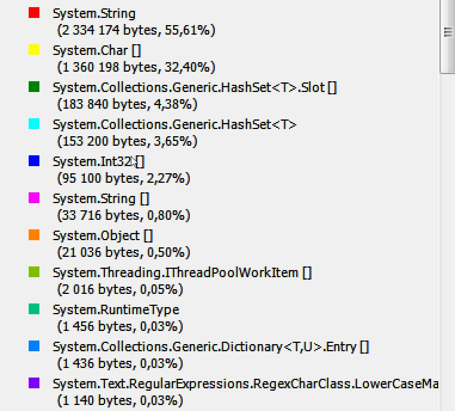

# Performance tests
input data: string(500)

## method - Solution - memory usage:

## method - SolutionImproved - memory usage:

## method - SolutionMultiThread - memory usage:

## method - Solution - execution time measure:

## method - SolutionImproved - execution time measure:

## method - SolutionMultiThread - execution time measure:

